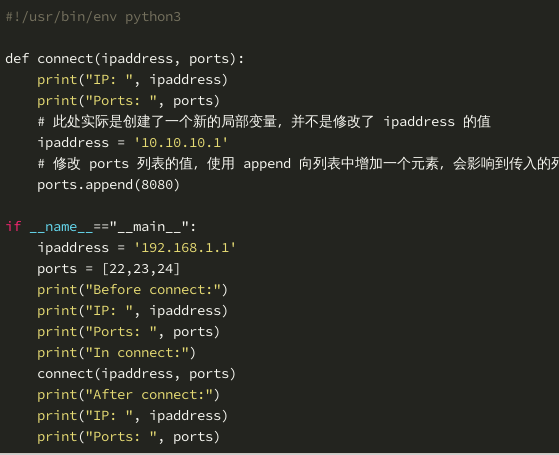

# 函数       
## 变量作用域       
1. 全局变量：global，把一个变量设置为全局变量之后，函数内部改变这个变量，函数外部也会改变。       
2. 局部变量报错       
```python       
a = 9       
def change():       
	print(a)       
	a = 100       
change()       
```       
现在就会报错了：“UnboundLocalError: local variable 'a' referenced before assignment”，原因是当函数中只要用到了变量 a，并且 a 出现在表达式等于号的前面，就会被当作局部变量。当执行到 print(a) 的时候会报错，因为 a 作为函数局部变量是在 print(a) 之后才定义的。       
       
## 函数的参数       
1. Python 常用参数有四种：必选参数、默认参数、可变参数和关键字参数。以上四种参数可复合使用，切记：复合使用时各类参数的定义顺序须同上。       
2. 默认参数: 默认参数的默认值必须设为不可变的数据类型（如字符串、元组、数字、布尔值、None 等）。 下面的代码是错误的示例，默认参数的默认值是空列表，因为列表是可变对象，调用函数后，默认参数的默认值会改变：       
```python       
def f(a, data=[]):       
	data.append(a)       
	return data       
>>> print(f(1))       
[1]       
>>> print(f(2))       
[1, 2]       
>>> print(f(3))       
[1, 2, 3]       
```       
要避免这个问题，可以像下面这样定义默认值：       
```python       
def f(a, data=None):       
	if data == None:       
	data = []       
	data.append(a)       
	return data       
       
>>> print(f(1))       
[1]       
>>> print(f(2))       
[2]       
```       
       
3. 可变参数：可变参数的定义格式是在参数名前面加上 * ，参数名可以自定义，通常写成 *args 。注意：在函数体内部使用该参数时，前面不要加 * 。 举例说明，我们的 connect 函数要连接目标服务器的多个端口号。       
```python       
def connect(ipaddress,*ports):       
	print("IP: ", ipaddress)       
	for port in ports:       
		print("Port: ",port)       
```       
       
4. 关键字参数：以上三种函数的参数（必选参数、默认参数、可变参数）在赋值时都可以不写参数名，而关键字参数允许传入零个或任意多个带参数名的参数，其中参数名可自定义，这些关键字参数会在函数内部自动生成一个字典，用来扩展函数的功能。 关键字参数的定义格式是在参数名前面加上 ** ，参数名可以自定义，通常写成 **kw 。注意：在函数体内部使用该参数时，前面不要加 ** 。 示例如下：       
```python       
def connect(ipaddress, *ports, **kw):       
	print("IP: ", ipaddress)       
	for port in ports:       
		print("Port: ", port)       
	for key,value in kw.items():       
		print('{}:{}'.format(key, value))       
```       
       
## 函数中修改参数值：       
1. Python 函数的参数是没有类型的，可以传递任意类型的对象作为参数。但不同类型的参数在函数中，有的可以修改（例如列表对象），有的不可以修改（例如字符串对象）。       
        
        
