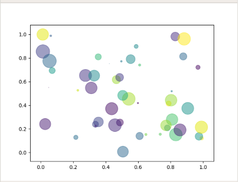
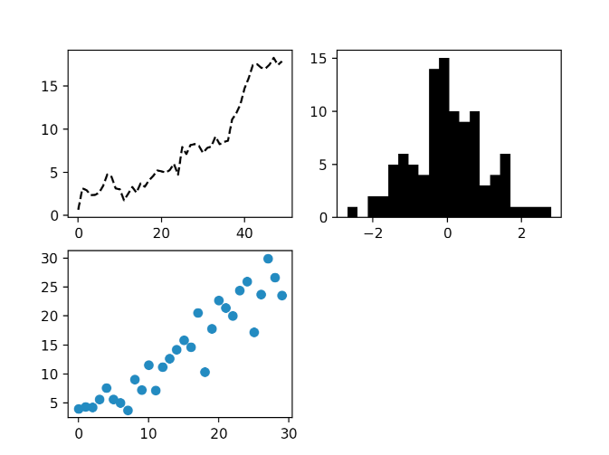
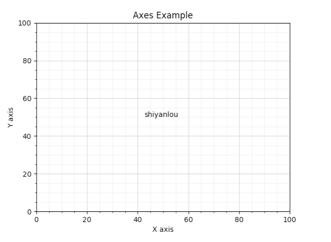
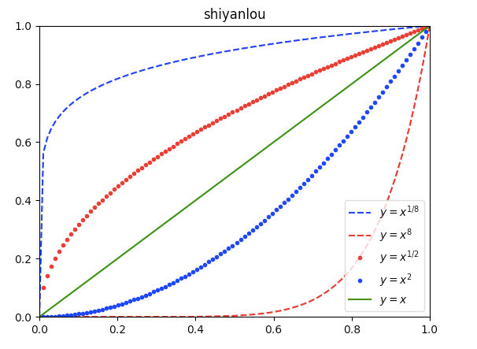
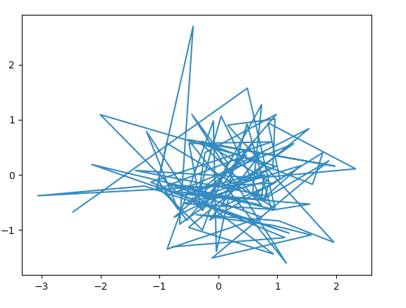
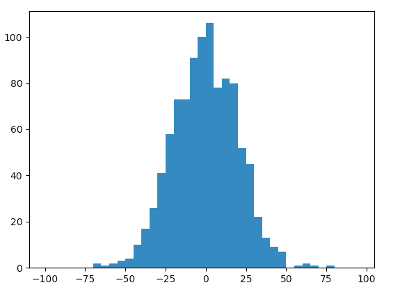
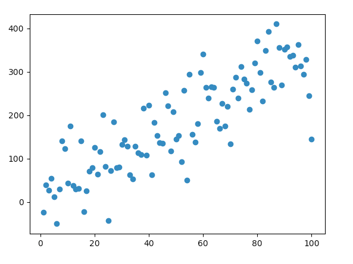
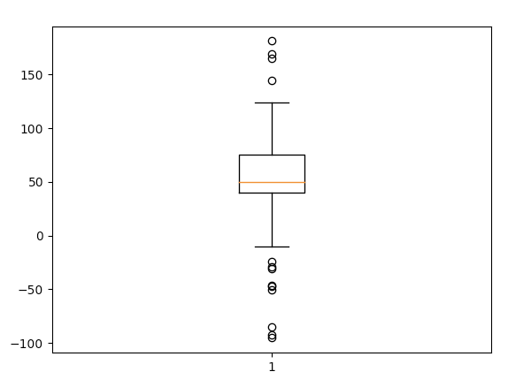

# 实验简介

1. 在数据分析中，数据可视化非常重要。我们可以将数据绘制成各种图形，比如直方图，散点图等，从图形中可以明显看出各种数据特征。本节实验中，我们将学习各种图形的用途，以及在 Python 中如何使用 matplotlib 以及其他工具绘制各种图形。

2. 知识点

* matplotlib 绘图基础知识
* matplotlib 常用属性设置
* 各种图形的用途
* Pandas 绘图

# matplotlib

1. matplotlib 目前是 Python 中功能最强大的绘图软件包，在开始其他内容之前，先让我们看下使用 matplotlib 生成散点图的代码：

```python
import numpy as np
import matplotlib.pyplot as plt

N = 50
x = np.random.rand(N)
y = np.random.rand(N)
colors = np.random.rand(N)
area = np.pi * (15 * np.random.rand(N))**2

plt.scatter(x, y, s=area, c=colors, alpha=0.5)
plt.show()
```

 

## matplotlib基础

1. matplotlib 是面向对象的绘图工具包，绘制的图形中每一个元素都是一个对象，比如线条，文字，刻度等信息，可以通过修改这些对象的属性，从而改变绘图样式。

2. matplotlib中主要的绘图对象列表如下：

* Figure 对象，可以想象为一张画布；
* Axes 对象，字面理解为坐标轴（因为每一个 Axes 都有一套 X Y轴坐标系，绘制图形时基于此坐标系绘制。) 也可以认为是子图，在一个 Figure 对象中可以包含多个 Axes 对象，也就是说一张画布可以包含多个子图；
* Line2D 对象，代表线条；
* Text 对象，代表了文字，比如一张子图需要标题，就可以使用一个 Text 对象；

3. 虽然 matplotlib 是面向对象的绘图工具包，但是也提供了一些常用的绘图方法，可以直接调用 plt 模块相关方法就可以完成各种绘图需求，这是因为 plt 模块内部保存了当前的 Figure 对象信息，当使用 plt 的相关方法绘图时，底层实际调用了当前 Figure 对象的相关方法。在前面的散点图例子中，我们没有创建过任何 Figure 对象也成功的绘制出了图形，这就是因为 plt 会默认创建 Figure 对象，并将它保存在 plt 模块内部。可以通过 plt.gcf() 和 plt.gca() 分别获取当前用于绘图的 Figure 和 Axes 对象。

```python
In [28]: fig1 = plt.figure()

In [29]: ax1 = fig1.add_subplot(1, 1, 1)

In [30]: fig1
Out[30]: <matplotlib.figure.Figure at 0x10e3a35f8>

In [31]: plt.gcf()
Out[31]: <matplotlib.figure.Figure at 0x10e3a35f8>

In [32]: ax1
Out[32]: <matplotlib.axes._subplots.AxesSubplot at 0x10e22f6d8>

In [33]: plt.gca()
Out[33]: <matplotlib.axes._subplots.AxesSubplot at 0x10e22f6d8>

In [34]: fig2 = plt.figure()

In [35]: ax2 = fig2.add_subplot(1, 1, 1)

In [36]: fig2
Out[36]: <matplotlib.figure.Figure at 0x10e415860>

In [37]: plt.gcf()
Out[37]: <matplotlib.figure.Figure at 0x10e415860>
```

4. 以上代码中，我们分别创建了 fig1 和 fig2 两个 Figure 对象，以及 ax1 和 ax2 两个 Axes 对象。可以看到，每当我们生成新的 Figure 对象时，plt.gcf() 获取到的当前的 Figure 对象也变成了新创建的 Figure 对象，因为他们的内存地址相同( at 字符后面是内存地址)。 fig.add_subplot(1, 1, 1) 方法，用于在 Figure 对象上创建一个新 Axes 对象，由于 Figure 对象可以包含多个 Axes 对象，所以这里的参数含义是说，添加一个 Axes 对象到布局为一行一列的第一个位置上。当然可以改变布局，比如 fig.add_subplot(2, 2, 1) 含义是添加一个 Axes 对象到布局为两行两列的第一个位置上，也就是说我们依次调用 fig.add_subplot(2, 2, 2), fig.add_subplot(2, 2, 3), fig.add_subplot(2, 2, 4） 在 Figure 对象上插入四个 Axes 对象，布局为两行两列，如下代码：

```python
In [70]: fig = plt.figure()

In [71]: ax1 = fig.add_subplot(2, 2, 1)

In [72]: ax2 = fig.add_subplot(2, 2, 2)

In [73]: ax3 = fig.add_subplot(2, 2, 3)

In [74]: ax1.plot(np.random.randn(50).cumsum(), 'k--')
Out[74]: [<matplotlib.lines.Line2D at 0x114df9b38>]

In [75]: _ = ax2.hist(np.random.randn(100), bins=20, color='k')

In [76]: ax3.scatter(np.arange(30), np.arange(30) + 3 * np.random.randn(30))
Out[76]: <matplotlib.collections.PathCollection at 0x114e6c748>

In [77]: fig.show()
```



## 常用属性设置

1. matplotlib 绘制的图形可以设置各种属性，比如设置坐标系的刻度，标题，标签等属性。下面我们将通过具体的例子演示。 matplotplib 绘制图形时，基于 X, Y 轴坐标系绘图。我们可以设置 X, Y 坐标的各种属性，比如刻度，范围，标签等属性，示例代码如下：

```python
import numpy as np                                                               
import matplotlib.pyplot as plt                                                                                                                                 

fig = plt.figure()                                                               
ax = fig.add_subplot(1,1,1)                                                      

# 设置标题
ax.set_title("Axes Example")

major_ticks = np.arange(0, 101, 20)                                              
minor_ticks = np.arange(0, 101, 5)                                               

# 设置刻度
ax.set_xticks(major_ticks)                                                       
ax.set_xticks(minor_ticks, minor=True)                                           
ax.set_yticks(major_ticks)                                                       
ax.set_yticks(minor_ticks, minor=True)                                         

# 设置 X, Y 轴 标签
ax.set_xlabel("X axis")
ax.set_ylabel("Y axis")

# 设置网格                                                                       
ax.grid(which='minor', alpha=0.2)                                                
ax.grid(which='major', alpha=0.5)

# 添加文字
ax.text(42.5, 50, "shiyanlou")
```

 

2. 下面我们具体分析下以上代码，首先创建了一个 Figure 对象，接着在该 Figure 对象上创建了唯一一个 Axes 对象，后续的所有属性都基于该 Axes 对象设置:


* ax.set_title 设置图形的标题；
* ax.set_xticks 设置 X 轴的刻度，其中 minor=True 参数表示设置更小的刻度；
* ax.set_yticks 设置 Y 轴的刻度；
* ax.set_xlabel 设置 X 轴的标签；
* ax.set_ylabel 设置 Y 轴的标签；
* ax.grid 开启图形的刻度网格，其中 which='minor' 参数表示显示小刻度的网格；
* ax.text 为图形添加文字，前两个参数表示添加的文字在坐标系中的位置；

3. 有的时候，我们想指定绘制的曲线的颜色，设置图例，该怎么办呢？示例代码：

```python
import numpy as np                                                               
import matplotlib.pyplot as plt                                                                                                                                 

x = np.linspace(0, 1,100)
fig = plt.figure()                                                               
ax = fig.add_subplot(1,1,1)
ax.set_title("shiyanlou")

ax.plot(x, x ** (1/8), 'b--', label=r'$y = x^{1/8}$')
ax.plot(x, x ** 8, 'r--', label=r'$y = x^{8}$')

ax.plot(x, x ** (1/2), 'r.', label=r'$y = x^{1/2}$')
ax.plot(x, x ** 2, 'b.', label=r'$y = x^{2}$')

ax.plot(x, x, 'g-', label=r'$y = x$')

ax.legend()
ax.axis([0, 1, 0, 1])
```



4. 在上面的代码中，通过 np.linspace(0, 1, 100) 创建了 100 个值，这些值平均分布在 0 到 1 的范围内。接着我们在 Axes 对象上绘制了 5 条曲线，这 5 条曲线分别对应于 5 个函数，函数名称已经通过图例的形式显示在图形上了。其中，我们使用类似于 ax.plot(x, x ** (1/8), 'b--', label=r'$y = x^{1/8}$') 方法绘制曲线，该方法有四个参数，前两个参数分别对应于 X, Y 轴的数据，绘图时会根据 x 和 x ** (1/8) 值序列确定曲线的位置。第三个参数 b-- 代表绘制的曲线是 blue 蓝色，样式是虚线。matplotlib 中有多种指定线条颜色和样式的办法，如 r-- 指明红色虚线，r. 代表红色点，更多的样式可以参考 matplotlib 文档。最后一个参数 label=r'$y = x^{1/8}$') 设置了线条的标签，该标签文字内容是数学公式，matplotlib 支持 LaTeX 语法显示各种数学公式。有的时候，我们想在图形上显示曲线标签信息，这个时候可以使用 ax.legend() 方法，该方法使用曲线的标签信息（也就是绘制曲线是传入的 label 参数）自动生成图例，并将图例放到图形合适的位置。最后为了方便查看图形，我们将图形的坐标设置成了 [0, 1, 0, 1] ，代表X, Y坐标轴范围都设置为 0 到 1。如果图形显示范围超过了 0 到 1 的范围，则会自动截取 0 到 1 范围内的图形进行显示。

5. matplotlib 绘图时可以设置很多属性，比如设置注解，设置外部图片等，这些都可以通过调用 Axes 对象相应方法进行，更多的用法可以查看 Axes 对象[API文档](https://matplotlib.org/api/axes_api.html)

## 使用matplotlib绘制常用的图形

1. 在数据分析中，经常需要绘制各种图形，下面我们看下一些常用图形在 matplotlib 中的绘制方法。为节省篇幅，以下说明代码中出现的 fig，ax 对象已经通过以下代码创建，matplotlib显示图形时的循环原因，每次创建新的图形上都需要重新执行：

```python
import numpy as np
import matplotlib.pyplot as plt

fig = plt.figure()
ax = fig.add_subplot(1,1,1)
```

### 线形图

1. 在 matplotlib 中可以使用 Axes.plot 方法绘制线形图：

```python
import numpy as np
import matplotlib.pyplot as plt

fig = plt.figure()
ax = fig.add_subplot(1,1,1)

x = np.random.randn(100)
y = np.random.randn(100)

ax.plot(x, y)
fig.show()
```

 

### 直方图

1. 直方图可以显示数据分布情况，X 轴一般是统计的样本，而 Y 是样本对应的统计度量。为了构建直方图，第一步是将值的范围分段，即将整个值的范围分成一系列间隔，然后计算每个间隔中有多少值。 这些值通常被指定为连续的，不重叠的变量间隔。 间隔必须相邻，并且通常是（但不是必须的）相等的大小。在 matplotlib 中可以使用 Axes.hist 方法绘制直方图：

```python
import numpy as np
import matplotlib.pyplot as plt

fig = plt.figure()
ax = fig.add_subplot(1,1,1)

data = np.random.normal(0, 20, 1000)
bins = np.arange(-100, 100, 5)
ax.hist(data, bins=bins)
fig.show()
```

** 上面的代码首先通过 np.random.normal 方法，产生 1000 个均值为 0 、标准差为 20 的正态分布数据值，然后通过 np.arange(-100, 100, 5) 创建了 X 轴的区间刻度。创建的图形类似下图： ** 



### 散点图

1. 散点图，将所有的数据值在图形中绘制成点，这样有多少数据值在图形中就会有多少个点。通过这些数据点可以看出数据值的分布模式，比如是否有聚类模式，或者相关关系或者发现离群点。在 matplotlib 中可以通过 Axes.scatter 绘制散点图：

```python
import numpy as np
import matplotlib.pyplot as plt

fig = plt.figure()
ax = fig.add_subplot(1,1,1)

x = np.arange(1, 101)
y = 20 + 3 * x + np.random.normal(0, 60, 100)
ax.scatter(x, y)
fig.show()
```

* 为了模拟散点图，我们先通过 np.arange(1, 101) 创建了 100 个数据值，接着基于此创建了 100 个 Y 轴数据，可以看到这里两组数据值之间有相关关系，因为是基于线性关系然后加上随机数生成的，绘制的散点图也证明了这点（图形向上倾斜）： * 

 

### 箱线图

1. 箱线图可以看出数据的分散程度，异常值等信息，箱线图根据一组数据的以下 5 个统计值进行绘制：

* 最小值；
* 第1四分位数；
* 中位数；
* 第3四分位数；
* 最大值；

2. 其中四分位数，是指将一组数据值按大小排序后分成四等分，每一部分包含 1/4 的数据，这种划分的分割点就是四分位数。其中第1部分和第2部分的分割点称为第1分位数 Q1, 也被称为第25百分位数，第3部分和第4部分的分割点称为第3四分位数 Q3，也被称为第75百分位数。而第二部分和第三部分的分割点是第2四分数，也就是中位数。其中四分位距 IQR 是指第三四分位数和第一分四分位数的差，也就是 IQR = Q3 - Q1。四分位距反映了中间 50% 数据的离散程度，数值越小代表数据越集中，越大代表数据越分散。

3. 在 matplotlib 中可以使用 Axes.boxplot 方法绘制箱线图：

```python
import numpy as np
import matplotlib.pyplot as plt

fig = plt.figure()
ax = fig.add_subplot(1,1,1)

# 产生 50 个小于 100 的随机数
spread = np.random.rand(50) * 100
# 产生 25 个值为 50 的数据
center = np.ones(25) * 50
# 异常值
outlier_high = np.random.rand(10) * 100 + 100
outlier_low = np.random.rand(10) * -100
data = np.concatenate((spread, center, outlier_high, outlier_low), 0)
ax.boxplot(data)
fig.show()
```

 

## Pandas绘图

1. matplotlib 绘制图像已经够方便，但是更多的时候我们使用 Pandas 分析数据，并把数据保存在 DataFrame 数据对象中。幸运的是，Pandas 已经高度整合了 matplotlib, 可以直接调用DataFrame 对象的某些方法进行绘图，更加方便的时候 DataFrame 的标签信息（列名称）会自动绘制到图形上。

```python
In [82]: import matplotlib.pyplot as plt

In [83]: import numpy as np

In [84]: import pandas as pd

In [85]: from pandas import Series, DataFrame
```

2. 可以直接在 Series 对象上绘制线形图，如下代码：

```python
In [79]: s = Series(np.random.randn(10).cumsum(), index=np.arange(0, 100, 10))

In [80]: s.plot()
Out[80]: <matplotlib.axes._subplots.AxesSubplot at 0x117e3e588>

In [81]: plt.show()
```

3. 在 DataFrame 对象上绘制箱线图：

```python
In [86]: df = pd.DataFrame(np.random.rand(5,4), columns=['A', 'B', 'C', 'D'])

In [87]: df.boxplot()
Out[87]: <matplotlib.axes._subplots.AxesSubplot at 0x115c2f5f8>

In [88]: plt.show()
```
