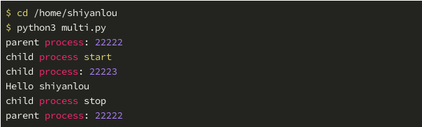
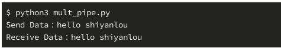
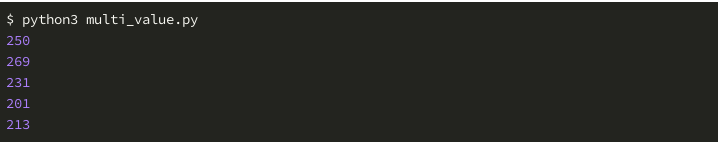
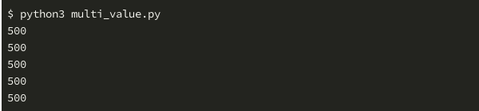
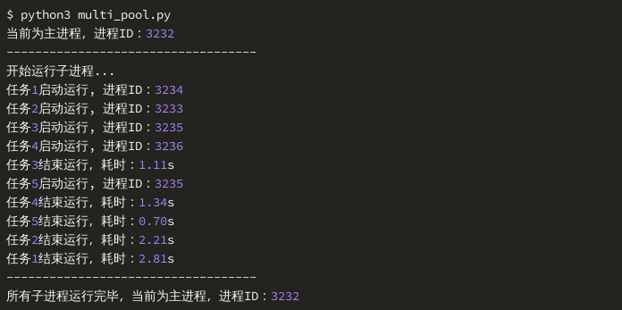
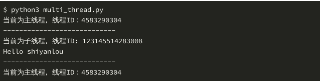

## Python多进程与多线程

### 多进程
1. 我们常见的 Linux、Windows、Mac OS 操作系统，都是支持多进程的多核操作系统。所谓多进程，就是系统可以同时运行多个任务。例如我们的电脑上运行着 QQ、浏览器、音乐播放器、影音播放器等。在操作系统中，每个任务就是一个进程。每个进程至少做一件事，多数进程会做很多事，例如影音播放器，要播放画面，同时要播放声音，在一个进程中，就有很多线程，每个线程做一件事，多个线程同时运行就是多线程。

### 一个简单的多进程程序
```python
import os
from multiprocessing import Process

def hello(name):
	# os.getpid() 用来获取当前进程ID
	print('child process: {}'.format(os.getpid())
	print('Hello ' + name)

	"""
	当我们运行一个 Python 程序，系统会创建一个进程来运行程序，
	被称为主进程或父进程前面课程中，我们写的程序都是单进程程序，
	即所有代码都运行在一个主进程中下面的 main() 函数就运行在主进程中
	"""
def main():
	# 打印当前进程即主进程ID
	print('parent process: {}'.format(os.gitpid()))
	# Process 对象只是一个子任务，运行该任务时系统会自动创建一个子程序
	# 注意args参数要以tuple的方式传入
	p = Process(target=hello,args=('shiyanlou',))
	print('child process start')
	# 启动一个子程序来运行子任务，该进程运行的是hello（）函数里的代码
	p.start()
	p.join()
	# 子进程完成后，继续运行主程序
	print('child process stop')
	print('parent process: {}'.format(os.getpid()))

if __name__=="__main__":
	main()
```

 

### 利用多进程提高程序运行效率
1. 单进程程序

```python
import time

def io_task():
    # time.sleep 强行挂起当前进程 1 秒钟
    # 所谓 ”挂起“，就是进程停滞，后续代码无法运行，CPU 无法进行工作的状态
    # 相当于进行了一个耗时 1 秒钟的 IO 操作
    # 上文提到过的，IO 操作可能会比较耗时，但它不会占用 CPU
    # 在这一秒时间内，CPU 可能被运算器派往其它进程 / 线程中工作
    time.sleep(1)

def main():
    start_time = time.time()
    # 循环 IO 操作 5 次
    for i in range(5):
        io_task()
    end_time = time.time()
    # 打印运行耗时，保留 2 位小数
    print('程序运行耗时：{:.2f}s'.format(end_time-start_time))

if __name__ == '__main__':
    main()
```

 

2. 多进程程序
```python
import time
from multiprocessing import Process

def io_task():
	time.sleep(1)

def main():
	start_time = time.time()

	process_list = []

	for i in range(5):
		process_list.append(Process(target=io_task))
	for process in process_list:
		process.start()
	for process in process_list:
		process.join()
	
	end_time = time.time()
	print('程序运行耗时: {:.2f}s'.format(end_time-start_time)

if __name__=="__main__":
	main()
```

 

### 程序间的通信
1. 进程有自己独立的运行空间，它们之间所有的变量、数据是隔绝的，A 进程中的变量 test 与 B 进程的变量没有任何关系，这就意味要使用一些特殊的手段才能实现它们之间的数据交换。multiprocessing 模块提供了管道 Pipe 和队列 Queue 两种方式。

#### Pipe
1. 如果把两个进程想象成两个密封的箱子，那 Pipe 就像是连接两个箱子的一个管道，借助它可以实现两个箱子之间简单的数据交换。
```python
# 首先引入 Pipe 类
from multiprocessing import Pipe
# 创建一个管道，注意 Pipe 的实例是一个元组，里面有两个连接器，可以把它们想象成通讯员
conn1, conn2 = Pipe()
```

2. 默认情况下，打开的管道是全双工的，也就是说你可以在任何一端读写数据，写入数据使用 send 方法，读取数据使用 recv 方法。下面看一个例子：
```python
from multiprocessing import Process, Pipe

conn1, conn2, = Pipe()

def send():
	data = "hello shiyanlou"
	coun1.send(data)
	print('Send Data: {}'.format(data))

def recv():
	data = conn2.revc()
	print('Receive Data: {}'.format(data))

def main():
	Process(target=send).starat()
	Process(target=recv).start()

if __name__=='__main__':
	main()
```



#### Queue

```python
from multiprocessing import Process, Queue

queue = Queue()		# 可以Queue(maxsize=10)来指定最大容量

def f1(q):
	i = 'Hello shiyanlou'
	q.put(i)
	print("Send Data: {}".format(i))

def f2(q):
	data = q.get()
	print("Receive Data: {}".format(data))

def main():
	Process(target=f1,argv(queue,)).start()
	Process(target=f2,argv(queue,)).start()

if __name__=="__main__":
	main()
```

 

### 进程同步
1. 看一个例子，有一个计数器 i，初始值为 0，现在创建并运行 10 个进程，每个进程对 i 进行 50 次加 1 操作，也就是说理论上最后的结果是 500。
2. Value 是一个方法，可以实现数据在多进程之间共享，该方法的返回值即 Value 对象可以看做是一个全局共享的变量。使用 help(Value) 查看参数，第一个参数是共享的数据类型，'i' 指的是 ctyps.c_int 就是整数，第二个参数是 Value 对象的值，在进程中可以通过 Value 对象的 value 属性获取。

```python
import time
from multiprocessing import Process, Value

# 该函数运行在子进程中，参数 val 是一个 Value 对象，是全局变量
def func(val):
    # 将 val 这个全局变量的值进行 50 次 +1 操作
    for i in range(50):
        time.sleep(0.01)
        val.value += 1

def main():
    # 多进程无法使用全局变量，multiprocessing 提供的 Value 是一个代理器，可以实现在多进程中共享这个变量
    # val 是一个 Value 对象，它是全局变量，数据类型为 int，初始值为 0
    val = Value('i', 0)
    # 创建 10 个任务，备用
    processes = [Process(target=func, args=(val,)) for i in range(10)]
    # 启动 10 个子进程来运行 procs 中的任务，对 Value 对象进行 +1 操作
    for p in processes:
        p.start()
    # join 方法使主进程挂起，直至所有子进程运行完毕
    for p in processes:
        p.join()
    print(val.value)

if __name__ == '__main__':
    for i in range(5):
        main()
```
3. 由于多进程的推进顺序是无法预测的，有可能出现几个进程同时对 i 进行加 1 操作，但由于 CPU 和内存的读写机制造成只有一个进程的加 1 的操作会被记录下来，这就导致最后的结果应该是小于 500 的，下面是程序运行 5 次的结果：

 

4. 正确的做法是每次进行加 1 操作时候，为 i 加一把锁，也就是说当前的进程在操作 i 时，其它进程不能操作它。multiprocessing 模块的 Lock 方法封装的锁操作，使用 acquire() 方法获取锁，release() 方法释放锁。下面是修正后的代码：
```python
import time
from multiprocessing import Process, Value, Lock

def func(val, lock):
    for i in range(50):
        time.sleep(0.01)
        # with lock 语句是对下面语句的简写：
        '''
        lock.acquire()
        val.value += 1
        lock.release()
        '''
        # 为 val 变量加锁，结果就是任何时刻只有一个进程可以获得 lock 锁
        # 自然 val 的值就不会同时被多个进程改变
        with lock:
            val.value += 1

def main():
    val = Value('i', 0)
    # 初始化锁
    # Lock 和 Value 一样，是一个函数或者叫方法，Lock 的返回值就是一把全局锁
    # 注意这把全局锁的使用范围就是当前主进程及其子进程，也就是在运行当前这个 Python 文件过程中有效
    lock = Lock()
    processes = [Process(target=func, args=(val, lock)) for i in range(10)]
    for p in processes:
        p.start()
    for p in processes:
        p.join()
    print(val.value)

if __name__ == '__main__':
    for i in range(5):
        main()
```

 

### 进程池

1. 进程池 Pool 可以批量创建子进程，进程池内维持一个固定的进程数量，当有任务到来时，就去池子中取一个进程处理任务，处理完后，进程被返回进程池。如果一个任务到来而池子中的进程都被占用了，那么任务就需要等待某一个进程执行完。
```python
import os, time, random
from multiprocessing import Pool

# 该函数将运行在子进程中
def task(name):
    # 打印进程 ID
    print('任务{}启动运行, 进程ID：{}'.format(name, os.getpid()))
    start = time.time()
    # 假设这里有一个比较耗时的 IO 操作
    # random.random() 的值是一个 0 到 1 区间内的（左闭右开）随机小数
    time.sleep(random.random() * 3)
    end = time.time()
    print('任务{}结束运行，耗时：{:.2f}s'.format(name, (end-start)))

if __name__=='__main__':
    print('当前为主进程，进程ID：{}'.format(os.getpid()))
    print('-----------------------------------')
    # 创建进程池，池子里面有 4 个子进程可用
    p = Pool(4)
    # 将 5 个任务加入到进程池
    for i in range(1, 6):
        # apply_async 方法异步启动进程池
        # 即池子内的进程是随机接收任务的，直到所有任务完成
        p.apply_async(task, args=(i,))
    # close 方法关闭进程池
    p.close()
    # join 方法挂起主进程，直到进程池内任务全部完成
    print('开始运行子进程...')
    p.join()
    print('-----------------------------------')
    print('所有子进程运行完毕，当前为主进程，进程ID：{}'.format(os.getpid()))
```

 

2. 运行情况分析
* 任务 1 2 3 4 是立即执行的，它们占据了进程池的全部 4 个进程。
* 任务 3 率先结束，耗时 1.11 秒，空出占用的 3235 进程，马上任务 5 开始在 3235 进程中运行。
* 等其余 4 个任务都完成了，任务 1 才结束运行，耗时 2.81 秒，甚至比任务 3 和 5 加起来的时间还要长，这就是 random.random 生成的随机小数的缘故。
* 每次运行的结果都是不同的，但流程不会变。

### 多线程
1. 前面我们讲到多任务可以由多进程来完成，而且在一些时候能够明显地提高代码的运行效率，多线程也可以实现类似的功能。一个进程中可以有一个或多个线程，进程内的线程共享内存空间。线程是程序执行的最小单元，一个进程中至少有一个线程（主线程）。因为解释器的设计原因，多线程在 Python 中使用得较少。
```python
import threading

def hello(name):
    # get_ident() 方法获取当前线程 ID
    print('当前为子线程，线程ID: {}'.format(threading.get_ident()))
    print('Hello ' + name)

def main():
    print('当前为主线程，线程ID：{}'.format(threading.get_ident()))
    print('----------------------------')
    # 初始化一个子线程，参数传递和使用 Process 一样
    t = threading.Thread(target=hello, args=('shiyanlou',))
    # 启动线程和等待线程结束，和 Process 的接口一样
    t.start()
    t.join()
    print('----------------------------')
    print('当前为主线程，线程ID：{}'.format(threading.get_ident()))

if __name__ == '__main__':
    main()
```


