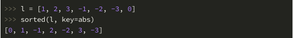

# Python高级特性            
     
## 高阶函数     
1. 所谓高阶函数（Higher-order function），简言之就是可以接受函数作为参数的函数。     
     
### sorted函数     
1. sorted 函数就是高阶函数，它有一个名为 key 的参数，可以接受函数。下面就讲一下 sorted 函数的高阶用法。     
     
      
     
2.sorted和lambda的混用：     
     
```python     
#!/usr/bin/env python3     
     
list1 = [('Shi', 100), ('Yan', 75), ('Lou', 200), ('Plus', 80)]     
     
sortedlist = sorted(list1, key=lambda i: i[1])     
     
print(sortedlist)     
     
[('Yan', 75), ('Plus', 80), ('Shi', 100), ('Lou', 200)]     
```     
     
### filter函数     
1. filter(a,b):a 为函数，b为被处理的数据类表。a会对b中的每一个元素进行判断（不用for循环），结果为真则保留，否则舍弃。     
     
2. 例子：     
     
```python     
pp = [('Leborn James', 98), ('Kevin Durant', 97), ('James Harden', 96), ('Stephen Curry', 95), ('Anthony Davis', 94)]     
     
def a(i):	# i为pp列表的一个元素，也就是其中的一个元组。     
	if int(i[1]) >= 96:     
		return True     
	else:     
		return False     
     
list(filter(a,pp))     
     
[('Leborn James', 98), ('Kevin Durant', 97), ('James Harden', 96)]	# 运行结果     
```     
     
### map/reduce函数     
     
1. map(a,b):a 是函数，用来处理 b 参数,b 是可迭代对象。对b中的元素，单个处理。     
     
```python     
pp = [('Leborn James', 98), ('Kevin Durant', 97), ('James Harden', 96), ('Stephen Curry', 95), ('Anthony Davis', 94)]     
     
def a(i):     
	return i[0].lower()     
     
list(map(a,pp))     
     
['leborn james', 'kevin durant', 'james harden', 'stephen curry', 'anthony davis']     
```     
     
2. reduce(a,b):a 是函数，用来处理 b 参数,b是可迭代对象。与 map 不同的是，reduce 的 a 函数对 b 序列做积累处理，     
     
```python     
b = [1, -2, 3, -4, -5, 6, 7, 8, -9]     
def a(x,y):     
	return x + y     
     
reduce(a,b)     
5     
```     
     
### lambda函数     
1. 匿名函数，顾名思义，这类函数没有函数名，这个特点的好处是避免自定义变量名冲突、减少代码量、使代码结构更加紧凑。缺点是不可重复使用。     
2. liat(map(lambda i: i[0].lower(),pp)) 代替map的用法     
     
## 偏函数     
### partial函数     
     
1. 与 reduce 一样，创建偏函数需要用到的 partial 函数也是来自 functools 这个模块。partial 函数接受两个参数，第一个参数为原函数名，第二个参数为原函数中的默认参数，partial 函数的返回值就是一个我们需要的新函数。     
2. 它的作用为更改默认参数：     
```python     
def cal_power(i,m=2):     
	return i**m     
```     
     
.png)      
     
### 切片     
1. 切片用于获取一个序列（列表或元组）或者字符串的一部分，返回一个新的序列或者字符串，使用方法是中括号中指定一个列表的开始下标与结束下标，用冒号隔开。     
     
### 列表解析     
1. [x for x in number if x % 2 == 0]  # 返回列表的偶数     
2. list(filter(lambda x: x % 2 == 0, numbers))	# 也可以完成，列表解析更为简洁易读一点。另外，由于使用高阶函数增加了调用函数的开销，以至它的使用效率不如列表解析，这就难怪连 Python 的作者也推荐使用列表解析了。     
     
### 字典解析     
1. d = {'a': 1, 'b': 2, 'c': 3}     
{k:v*v for k, v in d.items()}     
     
### 元组拆包     
1. Python 有个很强大的元组赋值特性，它允许等号左边的变量依次被元组内的元素赋值，这就是元组拆包。     
     
```python     
t = ('hello','shiyanlou')     
a,b = t     
a     
>>> 'hello'     
b     
>>> 'shiyanlou'     
```     
     
```python     
t = ('Tom',11)     
print("I'm {}, I\'m {} years old.'.format(*t))     
>>> I'm Tom, I'm 11 years old.     
```     
     
## 迭代器     
1. 要理解迭代器，首先需要明白迭代器和可迭代对象的区别。一个一个读取、操作对象称为迭代，Python 中，可迭代（Iterable）对象就是你能用 for 循环迭代它的元素，比如列表是可迭代的：     
     
2. 而迭代器是指，你能用 next 函数不断的去获取它的下一个值，直到迭代器返回 StopIteration异常。所有的可迭代对象都可以通过 iter 函数去获取它的迭代器，比如上面的 letters 是一个可迭代对象，那么这样去迭代它：     
     
.png)      
     
3. 所有的迭代器其实都实现了 __iter__ 和 __next__ 这俩个魔法方法，iter 与 next 函数实际上调用的是这两个魔法方法，上面的例子背后其实是这样的：     
     
.png)      
     
4. 迭代器的另一种实现方式，__iter__ + __next__：     
     
.png)      
     
5. 能被 for 循环访问的都是可迭代对象，能被 next 函数获取下一个值的是迭代器。     
     
## 生成器     
1. 生成器首先它是一个迭代器，和迭代器一样，生成器只能被遍历迭代一次，因为每次迭代的元素不是像列表元素一样，已经在内存中，每迭代一次，生成一个元素。     
     
2. 生成器和迭代器的主要区别在于：     
* 它们的创建方式不同     
* 生成器有一些特殊方法是迭代器不具有的     
     
3. 我们常见常用的生成器和迭代器作用都差不多，只是创建方式有所不同，下面介绍创建生成器的两种方法。     
     
4. 方法一，使用生成器表达式创建一个生成器并迭代：     
     
.png)      
     
方法二，使用 yield 编写生成器函数，函数的返回值就是生成器。     
     
yield 的使用方法和 return 类似。不同的是，return 可以返回有效的 Python 对象，而 yield 返回的是一个生成器，函数碰到 return 就直接返回了，而使用了 yield 的函数，到 yield 返回一个元素，当再次迭代生成器时，会从 yield 后面继续执行，直到遇到下一个 yield 或者函数结束退出。     
     
下面是一个迭代斐波那契数列前 n 个元素的列子：     
     
.png)      
     
5. 和列表解析有点像，只不过使用的是圆括号。不同于列表可以反复迭代，迭代完一次之后再迭代这个生成器，它不会打印元素，也不会报错。使用生成器有什么好处呢？因为生成器不是把所有元素存在内存，而是动态生成的，所以当你要迭代的对象有非常多的元素时，使用生成器能为你节约很多内存，这是一个内存友好的特性。     
     
## 装饰器     
1. 装饰器可以为函数添加额外的功能而不影响函数的主体功能。在 Python 中，函数是第一等公民，也就是说，函数可以做为参数传递给另外一个函数，一个函数可以将另一函数作为返回值，这就是装饰器实现的基础。装饰器本质上是一个函数，它接受一个函数作为参数。看一个简单的例子，也是装饰器的经典运用场景，记录函数的调用日志：     
