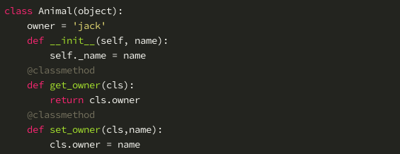
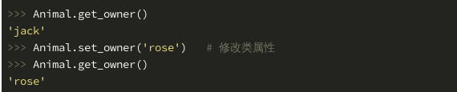
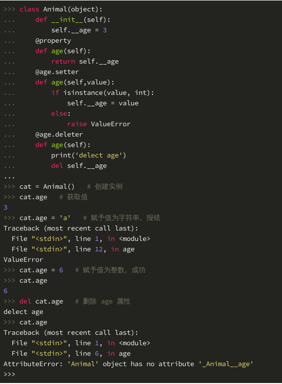

# 面向对象编程

## 什么是面向对象编程
1. 面向对象编程（Object Oriented Programming，简称 OOP，面向对象程序设计）是一种程序设计思想。用面向过程的思想设计程序时，程序是一条条指令的顺序执行，当指令变得多起来时，它们可以被分隔成我们先前实验中讲解过的函数。而面向对象编程则是将对象视为程序的组成单元，程序的执行通过调用对象提供的接口完成。
2. 面向对象的4个核心概念
* 抽象
* 封装
* 继承
* 多态

## 抽象
1. 把具有一些共同特征的事物抽象为一个类，具有类中的属性和方法时只要创造一个实例调用这个类。

## 封装
1. 在面向对象的语言中，封装就是用类将数据和基于数据的操作封装在一起，隐藏内部数据，对外提供公共的访问接口。
2. 不同于 Java 或者 C++，Python 没有特定的关键字声明私有属性Python 的私有属性用一个或两个下划线开头表示一个下划线表示外部调用者不应该直接调用这个属性，但还是可以调用到两个下划线外部就不能直接调用到了.

## 继承
1. 继承分为两种：单继承和多继承。单继承是指子类只继承于一个父类，相应的多继承是指子类继承于多个父类。
2. 重写：所谓重写父类的方法就是指：在子类中定义和父类同名的方法，那么子类中的该方法就会覆盖掉父类中对应的方法。

## 多态
1. 简单的说，多态就是使用同一方法对不同对象可以产生不同的结果。

## 私有属性和方法
1. 在 Python 中约定在属性方法名前添加 __ （两个下划线 _）来拒绝外部的访问。
2. 为什么说是“约定”，因为 Python 中没有绝对的私有，即使是 __ 两个下划线来约束，也是可以通过 obj._Classname__privateAttributeOrMethod 来访问：

## 类属性和类方法
1. 属于当前这个类，而不属于类创造的对象。可以直接类调用，不用实体化之后调用。
2. 类属性和类方法是可以直接使用类访问，不需要实例化，当然类的实例也是可以访问的。类属性是类对象的属性，通过类对象定义的实例对象都可以拥有这个属性，但是在类外，只有公有的类属性才可以被直接访问。假设上面例子中的动物都是 Jack 的宠物，那么就可以在 Animal 类中用一个类属性表示，类属性一般声明在 __init__ 方法之前：
3. 调用类属性和类方法：
 
 

## 静态方法
1. 可以直接用类名调用的方法。在静态方法上加上@staticmethod装饰

## 类中的方法归类：
| 名字 | 第一个参数强制为 | 在定义方法时可以引用 | 装饰器 |
| :----: | :----: | :----: | :----: |
| 实例方法 | 实例对象 self | 类属性、实例属性、类方法、实例方法 | 无 |
| 类方法 | 类对象 cls | 类属性、类方法 | @classmethod |
| 静态方法 | 无 | 类属性 | @staticmethod |

## property装饰器
1. @property 装饰器可以将一个方法变成一个属性来使用，通过 @property 装饰器可以获得和修改对象的某一个属性。

2. 使用 @property 装饰器的方法如下：

* 只有 @property 表示只读
* 同时有 @property 和 @*.setter 表示可读可写
* 同时有 @property、@*.setter、和 @*.deleter 表示可读可写可删除
* @property 必须定义在 @*.setter 的前面
* 类必须继承 object 父类，否则 @property 不会生效 
* 属性要为为私有属性

3. 具体实例：
 

4. 从这个简单的例子中我们可以发现 age 由一个函数转变为一个属性，并且通过增加一个 setter 函数的方式来支持 age 的设置。通过 property 和 setter ，可以有效地实现 get_age（获取对象的属性） 和 set_age（设置对象的属性）这两个操作，而不需要直接将内部的 __age 属性暴露出来，同时可以在 setter 函数中对设置的参数进行检查，避免了直接对 __age 内部属性进行赋值的潜在风险。

## 类中的特殊方法（内置方法）

### __new__和__del__

