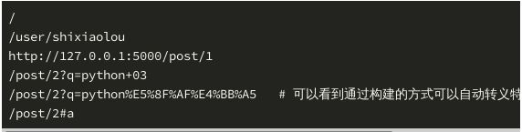

# Flask入门        
        
## 简介        
1. Flask 是 Python 社区比较知名的微框架。Flask 本身只维护一个核心，被设计成可以通过插件拓展。如果要和另一个知名的 Python Web 框架 Django 做对比的话，Django 更像一个大品牌出的电脑整机，你不用操心使用什么配件，你需要什么 Django 全家桶都有。而 Flask 可以说是一个组装机了，更准确的说是一个设计精良的 CPU。这给了你很大的灵活性去选择需要的配件（插件）。        
        
## 安装        
```shell        
sudo pip3 install flask==1.1.1        
```        
        
## 最小的应用        
        
```python        
from flask import Flask        
app = Flask(__name__)        
        
@app.route('/')        
def index():        
	return "Hello World!"        
        
if __name__ == "__main__":        
	app.run()        
```        
        
1. app = Flask(__name__)：这是用于初始化。使用时必须创建 Flask 类的实例对象 app，服务器使用 wsgi 协议把来自客户端的所有请求都转交给 app 对象处理。在生成实例对象时，需要传递 __name__ 参数，这个参数在 Python 解释器中会被解释为程序主模块或包的名字，这个参数决定了程序的根目录，以便之后从根目录去找到其它资源文件。        
        
2. @app.route('/')：这是路由。我们在浏览器中输入一个 URL，浏览器发送请求 URL 给 web 服务器，服务器转发请求 URL 给程序实例app，程序实例app把请求 URL 映射到对应的处理函数进行处理。处理 URL 和函数之间映射关系的程序称为路由。在 Flask 中定义路由会使用 @app.route() 装饰器，参数为请求的相对路径。        
        
3. index()：这是视图函数。对客户端请求进行处理的函数被称为视图函数，视图函数处理后会返回处理结果，再由 web 服务器把结果返回给客户端。        
        
### 设置环境变量        
```python        
export FLASK_APP=app.py	# 环境变量 FLASK_APP 是用来指向 flask run 执行的 Flask 应用代码的路径，这里是 app.py 的路径。        
export FLASK_DEBUG=1	# FLASK_DEBUG=1 表示打开 DEBUG 信息，可以输出访问和出错信息，帮助我们解决代码中出现的问题        
```        
        
1. 运行：        
```shell        
flask run        
```        
        
## 配置        
1. 初始化一个 Flask app 后，可以通过 app.config 管理配置。app.config 存储的配置信息本质上是个字典，所以你可以用字典的方法添加或者更新配置。比如说，初始化 app 后，配置一个密钥：        
```python        
app = Flask(__name__)        
app.config.update({        
    'SECRET_KEY': 'a random string'        
})        
```        
        
2. 所有的配置选项需要用大写，多个单词间用下划线 _连接。大型项目中，配置通常写在一个单独的 config.py 文件中，这时候就可以用 app.config 提供的特有方法来更新 config，参数是配置文件 config.py 的路径：        
```python        
app.config.from_pyfile('path/to/config.py')        
```        
        
3. 更多配置：        
        
* from_envvar(variable_name)：使用一个环境变量指定的配置文件更新配置        
* from_object(obj)：使用一个对象更新配置文件，dict 无效        
* from_json(filename)：使用 JSON 文件更新配置        
* from_mapping(*mapping, **kwargs)：类似前面的 update，不同的是，这个方法不强制使用大写字母        
        
4. 获得一个配置信息的方法是用字典的形式 app.config['SECRET_KEY'] 这样可以获得 SECRET_KEY 的配置值。        
        
## 路由和视图函数        
1. Flask 使用 @app.route 装饰器来将路由映射到对应的视图函数上，形成一一对应的关系，每一个路由都有对应的视图函数进行处理。        
2. 在路由中传入变量：        
```python        
@app.route("/user/<username>")        
def user_index(username):        
	return "Hello {}!".format(username)	# 在函数中指明变量名称 username，就能获取到通过路由传入的变量值 username        
        
```        
        
3. 还可以指定路由变量的类型，比如说，一个博客应用的每个博文页面可以用这篇博文的 ID 作为路由变量，ID 应该是个 int 类型的值:        
```python        
@app.route("/post/<int:post_id>")        
def show_post(post_id):        
	return "Post {}".format(post_id)        
```        
        
## url_for函数        
1. 在 Flask 中不仅可以静态匹配 URL，也可以使用 url_for() 函数在程序中动态构造 URL。        
2. url_for函数的第一个参数是视图函数的名字，如果该视图函数对应的URL需要传递参数则以key=value的形式写在后面，未知变量部分会添加到URL末尾作为查询参数。url_for()函数最终返回的是视图函数对应的URL地址。        
3. 使用方法：url_for('函数名', 命名函数， 其他参数， _external, _anchor)        
```python        
from flask import url_for        
        
@app.route('/test')        
def test():        
	print(url_for('index'))		# 打印视图函数index的相对地址        
	print(url_for('user_index', username='shixiaolou'))        
	print(url_for('show_post', post_id=1,_external=True))        
	print(url_for('show_post', post_id=2, q='python 03'))        
	print(url_for('show_post', post_id=2, q='可以‘))        
	print(url_for('show_post', port_id=2, _anchor'a'))        
	return 'test'        
```        
        
         
        
## redirect函数        
1. 在 Flask 中可以使用重定向 redirect() 把来自客户端的请求 URL 地址重定向到另外一个 URL 地址，实现访问地址的自动跳转。 redirect() 方法通常和 url_for() 方法一起使用。        
```python        
from flask import redirect        
        
@app.route("/<username>")        
def hello(username):        
	if username == 'shixiaolou':	# 如果访问/shixiaolou则显示页面        
		return 'Hello {}'.format(username)        
	else:        
		return redirect(url_for('index'))	# 否则重定向到主页        
```        
        
## render_template 模板渲染        
1. 在上面的例子中，处理函数返回的都是字符串，但是在真正的项目中，需要使用 HTML 编写页面，不可能把所有的内容都写到字符串中。模板引擎的作用就是你用模板引擎规定的语法编写 HTML 页面，在处理函数中指定模板，传入相应的模板变量，Flask 就能调用模板引擎自动渲染出一个完整的 HTML 页面。        
2. Flask 使用 render_template 函数渲染模板，指定了一个模板名称后，Flask 会到 templates 目录下去找这个模板，然后使用传入的变量渲染模板。        
3. 把函数代码放/目录：        
```python        
from flask import Flask, render_template        
        
app = Flask(__name__)        
        
@app.route("/user/<username>")        
def user_index(username):        
	return render_template('user_index.html', username=username)        
```        
        
[/templates/user_index.html]        
```python        
<h1>Hello, {{ username }}!</h1>        
```        
        
## GET和POST        
1. Flask 通过 request 对象获取请求相关的数据，要使用它，要从 flask 导入：        
```python        
from flask import request        
```        
        
2. 一般常用的两种请求方式就是：GET 请求和 POST 请求。其中：        
        
* GET 请求: 只是从服务器上获取数据，不会对服务器上的数据产生影响（通常只是查询操作）。传参放在 URL 中，通过?的形式指定 key 和 value 。GET 请求获取参数是通过 request.args.get('key') 来获取。        
* POST 请求: 用于向指定的资源提交待被处理的数据，会对服务器上的数据产生影响（做增加、删除或是修改的操作）。传参不放在 URL 中，通过表单数据的形式发送给服务器。POST 请求获取参数是通过 request.form.get('key') 来获取。        
        
### GET请求        
1. 从 request.headers 获取请求头的数据，可以把它当作字典来使用，比如要获取用户的 user-agent：        
```python        
request.header.get('User-Agent')        
```        
        
2. 从 request.args 获取请求的参数，修改 /home/shiyanlou/app.py 文件中的 user_index 函数代码如下所示：        
```python        
from flask import request        
        
@app.route('/user/<username>')        
def user_index(username):        
    print('User-Agent:', request.headers.get('User-Agent'))   # 打印请求头的数据        
    print('time:', request.args.get('time'))   # 获取请求 URL 中 ？后面的 time 参数        
    print('q:', request.args.get('q'))   # 获取请求 URL 中 ？后面的 q 参数        
    print('Q:', request.args.getlist('Q'))   # 当参数的值不止一个时使用 getlist 方法        
    return 'Hello {}'.format(username)        
```        
        
3. 运行 flask run，用下面这个 URL 访问用户页面：        
         
        
### POST请求        
1. 一般而言，POST 请求是通过表单传递数据的，可以通过 request.form 获取表单数据，通过 request.method 获取当前请求的方法（GET 或 POST）。        
2. 新建 client.py 文件，向文件中写入需要发送的数据：        
```python        
import requests        
        
# 设置要发送的数据        
user_info = {'name':'shixiaolou', 'password': 'abc123', 'hobbies': ['code','swim'])        
# 向URL发送post请求        
r = requests.post("http://127.0.0.1:5000/register",data=user_info)        
# 打印返回文本        
print(r.text)        
```        
        
3. app.py 文件中添加一个注册 register 的路由和视图函数：        
```python        
@app.route('/register', methods=['GET', 'POST'])   # 如果需要处理 POST 请求，就需要指定 methods=['GET', 'POST']        
def register():        
    print('method:', request.method)                     # 查看本次请求的方式        
    print('name:', request.form.get('name'))             # 获取 name 值        
    print('password:', request.form.get('password'))     # 获取 password 值        
    print('hobbies:', request.form.getlist('hobbies'))   # 获取 hobbies 值，因为有多项使用 getlist 方法        
    print('age:', request.form.get('age', default=18))   # 如果没有传递 age 值，可以在程序中设置默认值        
    return 'registered successfully!'        
```        
        
         
        
## session        
1. HTTP 协议是无状态的，每一次请求它们的关系都是相互独立的。但是在实际的应用中，我们确实有很多数据需要服务器记住，但又不适合存放在数据库中。比如说，一个登录页面需要在用户密码错误输入 3 次后要求输入验证码，服务器就需要一个计数器纪录错误次数，但把它放到数据库也不太合适。session 就是用来为每个用户独立存放一些数据的地方。存放在 session 里的数据可以在特定用户的多个请求之间共享。因此 session 是在服务端保存的一个数据结构，用来追踪用户的状态。        
2. session 的常见使用方法如下：        
```python        
from flask import session        
from datetime import timedelta        
        
# 设置 session        
@app.route('/set_session')        
def set_session():        
    session.permanent = True   # 设置session的持久化        
    app.permanent_session_lifetime = timedelta(minutes=5)   # 设置session的存活时间为5分钟        
    session['username'] = 'shixiaolou'        
    return '成功设置session'        
        
# 获取 session        
@app.route('/get_session')        
def get_session():        
    value = session.get('username')        
    return '获取的session值为{}'.format(value)        
        
# 移除 session        
@app.route('/del_session')        
def del_session():        
    value = session.pop('username')        
    return '成功移除session，其值为{}'.format(value)        
```        
        
## cookies        
1. cookies 与 session 类似，只不过 cookies 是以文本文件的形式存在于客户端的加密信息。在 Flask 中，cookie 也使用配置的 SECRET_KEY 作为签名进行加密。        
2. 在 flask 中，cookies 设置在响应对象上，使用 make_response() 函数从视图函数的返回值中获取响应对象，使用响应对象的 set_cookie() 函数存储 cookie 。        
3. cookie 常见用法设置：        
        
         
        
4. 比如在访问用户主页的路由中，将用户名设置为一个 cookie，这样用户再次访问时，我们就能知道他是谁了:        
```python        
from flask import make_response        
        
@app.route('/user/<username>')        
def user_index(username):        
	resp = make_response(render_template('user_html',username=username))        
	resp.set        
_cookie('username',username)        
	return resp        
```        
        
5. 设置 cookies 后，用户访问其他页面可以从 request.cookies 获取到我们设置的 username，request.cookies 获取到的是一个由 cookie 变量作为键对应值作为值的字典：        
```python        
from flask import request        
        
@app.route('/')        
def index():        
	username = request.cookies.get('username')        
	return "Hello {}".format(usename)        
```        
        
## 错误处理        
1. 使用 app.errorhandler 装饰器可以注册错误处理函数，比如对于最常见的 404 错误，我们返回一个特定的 404.html 页面。        
```python        
@app.errorhandler(404)        
def not_found(error):        
	return render_template('404.html'), 404		# 自己定义404模板        
```        
        
2. 在 flask 中还有一个经常用来处理错误的方法 abort()，使用 abort(404) 则能够直接进入到页面无法找到（HTTP 状态码404）的处理逻辑中。        
```python        
from flask import Flask, render_template, abort        
        
app = Flask(__name__)        
        
@app.route('/user/<username>')        
def user_index(username):        
	if username == 'invalid':        
		abort(404)	# 返回的是自定义的404.html        
	return render_template('user_index.html', username=username)        
```        
