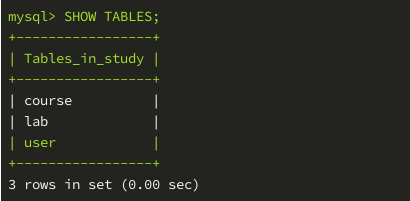
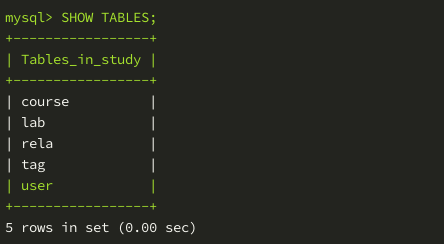
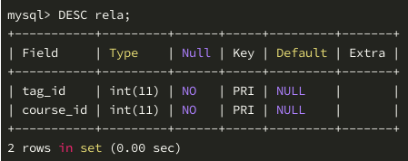
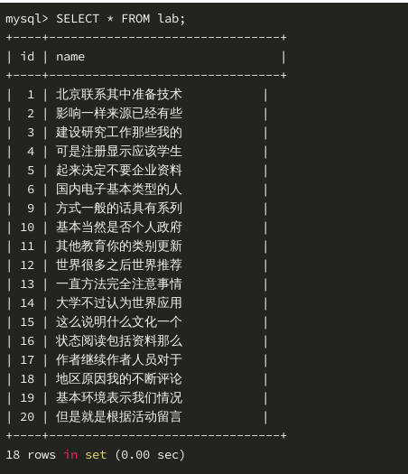
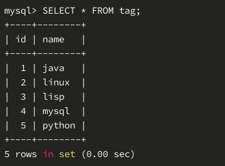
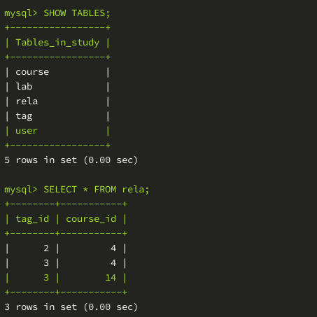

# SQLAlchemy一对多关系和多对多关系          
          
## 一对一关系          
          
1. 本节实验我们来学习创建一对一、多对多关系的数据表。为了方便演示，假设我们的每个课程只有一个实验，我们要创建映射类 Lab 和实验表 lab，课程和实验就是一对一的关系，如何实现这种关系呢？把 lab 的主键 id 设置为外键关联到 course 的主键 id 即可，因为主键是自带唯一约束的，这样就实现了一对一关系。          
          
2. 创建映射类 Lab，将以下代码写入 db.py 文件：          
          
   ```python          
   class Lab(Base):          
       __tablename__ = 'lab'          
       # 设置主键为外键，关联course表的id字段          
       # 注意参数的顺序，先定义外键，再定义主键          
       id = Colunm(Integer, ForeignKey('course.id'), primay_key=True)          
       name = Column(String(128))          
       # 设置查询接口，Lab 实例的 course 属性值为 Course 实例          
       # Course 实例的 lab 属性值默认为列表，列表中有一个 Lab 实例          
       # uselist 参数可以设置 Course 实例的 lab 属性值为 Lab 实例而非列表          
       course = relationship('Course', backref=backref('lab', uselist=False))          
             
       def __repr__(self):          
           return '<Lab: {}>'.format(self.name)          
   ```          
          
3. 保存代码后，在终端运行文件即可生成数据表：          
          
   ```python          
   python3 db.py          
   ```          
          
4. 查看数据库：          
           
          
## 多对多关系          
1. 一个课程可以有多个标签，每个标签可以贴在多个课程上，我们需要实现 course 课程表和 tag 标签表的多对多关系。          
          
* 一对多关系：一个 User 实例（课程教师）对应多个 Course 实例，一个 Course 实例对应一个 User 实例。          
* 一对一关系：一个 Course 实例对应一个 Lab 实例，一个 Lab 实例对应一个 Course 实例。          
* 多对多关系：一个 Course 实例对应多个 Tag 实例，一个 Tag 实例对应多个 Course 实例。          
          
2. 满足上述需求的多对多关系，需要在创建 Tag 映射类之前，首先创建中间表的映射类，用 Table 这个特殊类创建，此类的实例就是映射类。          
```python          
# 引入 Table 类          
from sqlalchemy import Table          
          
# 创建 Table 类的实例，即中间表映射类，赋值给变量 Rela          
# 该类在实例化时，接收 4 个参数：          
# 1、数据表名字 2、Base.metadata          
# 3 和 4、两个 Column（列名，数据类型，外键，主键）          
Rela = Table('rela', Base.metadata,          
        Column('tag_id', Integer, ForeignKey('tag.id'), primary_key=True),          
        Column('course_id', Integer, ForeignKey('course.id'), primary_key=True)          
)          
```          
          
2. 有了中间表的映射类，就可以创建 tag 表的映射类 Tag 了，将以下代码写入 db.py 文件中：          
```python          
class Tag(Base):          
    __tablename__ = 'tag'          
    id = Column(Integer, primary_key=True)          
    name = Column(String(64), unique=True)          
    # 设置查询接口，secondary 指定多对多关系的中间表，注意数据类型不是字符串          
    course = relationship('Course', secondary=Rela, backref='tag')          
          
    def __repr__(self):          
        return '<Tag: {}>'.format(self.name)          
```          
          
3. 同样地，终端运行文件生成数据表：          
```python          
python3 db.py          
```          
          
4. 注意中间表是真实存在的数据表，它有两个字段，当我们给课程添加标签时，该表会记录相关信息：          
          
           
          
           
          
## 创建测试数据          
1. 下面对 create_data.py 文件补充一些代码，我们用 10 个随机中文汉字作为 lab 表的 name 字段的值，创建 20 个 Lab 类的实例，10 个 Tag 类的实例，补充代码如下：          
```python          
from db import Lab, Tag          
          
def create_labs():          
    for course in session.query(Course):          
        lab = Lab(name=''.join(fake.words(5)), id=course.id)          
        session.add(lab)          
          
def create_tags():          
    for name in ['python', 'linux', 'java', 'mysql', 'lisp']:          
        tag = Tag(name=name)          
        session.add(tag)          
```          
          
2. 启动命令行交互解释器 ipython，引入相关对象，执行创建数据的函数：          
```python          
In [1]: from create_data import *          
          
In [2]: create_labs()          
          
In [3]: create_tags()          
          
In [4]: session.commit()          
```          
          
3. 查看数据库内数据：          
          
           
          
           
          
## 给课程添加标签          
1. 课程实例有 tag 属性，这是在映射类中设置的查询接口，标签实例也有对应的查询接口 course，它们的属性值均为空列表，如果要给课程添加标签，只需将标签实例添加到 tag 属性的列表中，给标签添加课程同理，举例如下：          
```python          
# 通过查询将两个课程实例赋值给变量 c1 c2 ，将两个标签实例赋值给 t1 t2          
In [6]: c1 = session.query(Course)[3]          
          
In [7]: c2 = session.query(Course)[11]          
          
In [8]: t1 = session.query(Tag)[1]          
          
In [9]: t2 = session.query(Tag)[2]          
          
# 课程的 tag 属性默认为空列表          
In [10]: c1.tag          
Out[10]: []          
          
# 将标签实例添加到列表          
In [11]: c1.tag.append(t1)          
          
In [12]: c1.tag.append(t2)          
          
# 标签的 course 属性里就有了对应的课程实例          
In [13]: t1.course          
Out[13]: [<Course: 次数通过评论等级>]          
          
# 当然了，课程实例的 tag 属性里有了两个标签实例          
In [14]: c1.tag          
Out[14]: [<Tag: linux>, <Tag: lisp>]          
          
In [15]: t2.course.append(c2)          
          
In [16]: c2.tag          
Out[16]: [<Tag: lisp>]          
          
# 执行 session.commit() 即可将它们的关系传入数据库中          
In [17]: session.commit()          
          
In [18]:          
```          
          
2. 查看数据库的中间表，可以看到给课程添加标签后，每组关系都被保存在该表中：          
          
           
