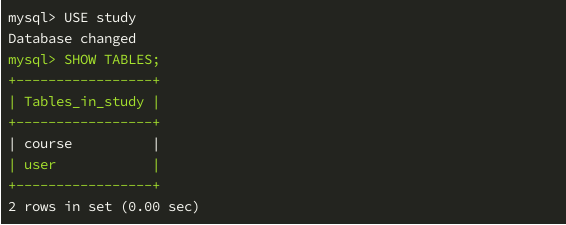

# SQL和ORM        
1. 数据库 DataBase 是按照数据结构来组织、存储和管理数据的仓库，它的产生距今已有六十多年。随着信息技术和市场的发展，数据库变得无处不在：它在电子商务、银行系统等众多领域都被广泛使用，且成为其系统的重要组成部分。SQL 是英文 Structured Query Language 的缩写，意为结构化查询语言。SQL 的主要功能就是同各种数据库建立联系，进行沟通。按照美国国家标准协会的规定，SQL 被作为关系型数据库管理系统的标准语言。        
        
         
        
2. ORM 是英文 Object Relational Mapping 的缩写，意为对象关系映射。对应到 Python 中，我们可以设计一个类把上文关系数据库的表结构映射到该类上：        
```python        
class User:        
    def __init__(self, id, name):        
        self.id = id        
        self.name = name        
        
[        
    User(1, 'Javy'),        
    User(2, 'Nash'),        
    User(3, 'Yanxue'),        
    User(4, 'Wujing'),        
    User(5, 'Thmos')        
]        
```        
        
3. 要实现 MySQL 数据表到 Python 类的映射，就需要 ORM 框架的帮助。在 Python 中有多个选择，例如轻量的 SQLobject 框架、Storm 框架、Django 内置的 ORM、著名的 SQLAlchemy 以及基于前者的 flask 插件 flask-SQLAlchemy 等。         
        
## SQLAlchemy简介和安装        
1. SQLAlchemy 是针对 Python 编程语言经过 MIT 许可的开源 ORM 框架，它采用数据库映射模式提供了企业级的持久化功能，专为高效率和高性能的数据库访问设计，是一个简单的针对 Python 语言的完整套件。它是 Python 中最有名的 ORM 框架。        
        
2. SQLAlchemy 作为 Python 工具包，可以使用包管理工具 pip 来安装，终端执行以下命令即可安装：        
```python        
sudo pip3 install sqlalchemy        
```        
        
## 使用SQLAlchemy创建映射类        
1. 数据库的默认编码为 latin1，修改数据表的默认编码是 MySQL 的一个基本操作，这是需要预先掌握的。不过学习本课程时并不需要这么做，在创建数据库的同时添加 CHARACTER SET = UTF8 指定编码格式即可。我们要创建课程相关的映射类以及对应的数据表，现在先创建所需数据库 study ，编码格式为 UTF-8 ：        
```sql        
mysql -u root        
create database study character set = UTF8;        
show create database study\G        
```        
        
         
        
## 引擎和声明基类        
```python        
from sqlalchemy import create_engine        
        
# 参数字符串说明：数据库类型+驱动://用户名:密码@主机:端口号/数据库名字?charset=编码格式        
# mysql 自带驱动，密码未设定，端口号可省略        
engine = create_engine('mysql://root@localhost/study?charset=utf8')        
        
# 创建映射类需要继承声明基类，使用 declarative_base ：        
from sqlalchemy.ext.declarative import declarative_base        
        
# 创建声明基类时传入引擎        
Base = declarative_base(engine)        
```        
        
## 创建第一个映射类        
1. 创建映射类须继承声明基类。首先创建 user 数据表的映射类，此表存放用户数据，也就是课程作者的数据：        
```python        
# Column 定义字段，Integer、String 分别为整数和字符串数据类型        
from sqlalchemy import Column, Integer, String        
        
        
class User(Base):           # 继承声明基类        
    __tablename__ = 'user'  # 设置数据表名字，不可省略        
    id = Column(Integer, primary_key=True)   # 设置该字段为主键        
    # unique 设置唯一约束，nullable 设置非空约束        
    name = Column(String(64), unique=True, nullable=False)        
    email = Column(String(64), unique=True)        
        
    # 此特殊方法定义实例的打印样式        
    def __repr__(self):        
        return '<User: {}>'.format(self.name)        
```        
        
2. 一对多关系，现在创建第二个映射类 Course，它对应的数据表 course 存放课程数据。一个课程作者可以创建多个课程，一个课程对应唯一的课程作者，这种关系被称为一对多或者多对一关系，这是最常用的数据表关系类型：        
```python        
from sqlalchemy import ForeignKey        
from sqlalchemy.orm import relationship, backref        
        
        
class Course(Base):        
    __tablename__ = 'course'        
    id = Column(Integer, primary_key=True)        
    name = Column(String(64))        
    # ForeignKey 设置外键关联，第一个参数为字符串，user 为数据表名，id 为字段名        
    # 第二个参数 ondelete 设置删除 User 实例后对关联的 Course 实例的处理规则        
    # 'CASCADE' 表示级联删除，删除用户实例后，对应的课程实例也会被连带删除        
    user_id = Column(Integer, ForeignKey('user.id', ondelete='CASCADE'))        
    # relationship 设置查询接口，以便后期进行数据库查询操作        
    # 第一个参数为位置参数，参数值为外键关联的映射类名，数据类型为字符串        
    # 第二个参数 backref 设置反向查询接口        
    # backref 的第一个参数 'course' 为查询属性，User 实例使用该属性可以获得相关课程实例的列表        
    # backref 的第二个参数 cascade 如此设置即可实现 Python 语句删除用户数据时级联删除课程数据        
    user = relationship('User',         
            backref=backref('course', cascade='all, delete-orphan'))        
        
    def __repr__(self):        
        return '<Course: {}>'.format(self.name)        
```        
        
#### 定义时常用的参数表：        
        
| 参数 | 说明 |        
| :----: | :----: |        
| primary_key |	如果设为 True，这列就是表的主键 |        
| unique | 默认值为 False，如果设为 True，这列不允许出现重复的值 |        
| index | 如果设为 True，为这列创建索引，提升查询效率 |        
| nullable | 默认值为 True，这列允许使用空值；如果设为 False，这列不允许使用空值 |        
| default | 为这列定义默认值 |        
        
2. 常用的 SQLAlchemy 查询关系选项（在 backref 中使用）：        

| 选项 | 说明 |        
| :----: | :----: |        
| backref | 在关系的另一个映射类中添加反向引用 |        
| lazy | 指定如何加载查询记录。可选值有 select (首次访问时按需加载)、immediate (源对象加 载后就加载)、joined (加载记录，但使用联结)， noload (永不加载)和 dynamic (不加载记录，但提供加载记录的查询，比较常用) |        
| cascade | 设置级联删除的方式 ，设置级联删除的方 |        
| uselist | 如果设为 False ，查询结果不使用列表，而使用映射类实例（下节课程会用到）|        
| order_by | 指定查询记录的排序方式 |        
| secondary | 指定多对多关系中关系表的名字（下节课程会用到）|        
        
## 创建数据表        
1. 声明基类 Base 在创建之后并不会主动连接数据库，因为它的默认设置为惰性模式。Base 的 metadata 有个 create_all 方法，执行此方法会主动连接数据库并创建全部数据表，完成之后自动断开与数据库的连接：        
```python        
Base.metadata.create_all()        
```        
        
# 完整代码        
```python        
# File Name：db.py        
        
from sqlalchemy import create_engine, Column, Integer, String, ForeignKey        
from sqlalchemy.ext.declarative import declarative_base        
from sqlalchemy.orm import relationship, backref        
        
engine = create_engine('mysql://root@localhost/study?charset=utf8')        
Base = declarative_base(engine)        
        
        
class User(Base):          
    __tablename__ = 'user'          
    id = Column(Integer, primary_key=True)         
    name = Column(String(64), unique=True, nullable=False)        
    email = Column(String(64), unique=True)        
        
    def __repr__(self):        
        return '<User: {}>'.format(self.name)        
        
        
class Course(Base):        
    __tablename__ = 'course'        
    id = Column(Integer, primary_key=True)        
    name = Column(String(64))        
    user_id = Column(Integer, ForeignKey('user.id', ondelete='CASCADE'))        
    user = relationship('User',        
            backref=backref('course', cascade='all, delete-orphan'))        
        
    def __repr__(self):        
        return '<Course: {}>'.format(self.name)        
        
        
if __name__ == '__main__':        
    # 使用声明基类的 metadata 对象的 create_all 方法创建数据表：        
    Base.metadata.create_all()        
```        
        
1. 在终端使用 Python 解释器运行文件，在此之前先安装一个必要的依赖包 mysqlclient，该依赖包的作用是连接数据库：        
```python        
$ sudo pip3 install mysqlclient  # 安装依赖包，此按照包是c语言，要下载gcc编译        
$ python3 db.py                  # 运行文件，使用映射类创建对应的数据表        
```        
        
2. 在 MySQL 客户端可以查看到新建的两张表：        
        
         
        
## 添加测试数据        
1. 测试数据的创建需要用到 Python 的 faker 库，使用 pip3 安装先：        
```shell        
sudo pip3 install faker        
suod pip3 install ipython        
```        
        
2. 完成后终端执行 ipython 命令，即可进入命令行交互解释器：        
```python        
In [38]: from faker import Faker  # 引入 Faker 类        
        
# 创建实例，添加参数 'zh-cn' 是为了伪造中文数据        
# 该实例叫做工厂对象，它可以使用各种各样的方法伪造数据        
In [39]: fake = Faker('zh-cn')               
        
In [40]: fake.name()     # 伪造姓名        
Out[40]: '房明'        
        
In [41]: fake.address()  # 伪造地址        
Out[41]: '山西省梅市上街董路Q座 238175'        
        
In [42]: fake.email()    # 伪造邮箱        
Out[42]: 'oqiu@rn.net'        
        
In [43]: fake.url()      # 伪造 URL        
Out[43]: 'https://www.yuzhu.cn/'        
        
In [44]: fake.date()     # 伪造日期        
Out[44]: '2012-07-03'        
```        
        
## session处理数据        
1. 上文已经介绍了使用映射类创建数据表要用声明基类 Base，那么处理数据用什么呢？要用到 session，它是 sessionmaker 类的实例，该实例实现了 __call__ 方法，本身可以作为函数来执行，返回值就是能够处理数据的 session：        
        
```python        
from sqlalchemy.orm import sessionmaker        
        
# 从 db.py 文件中引入下列对象备用        
from db import Base, engine, User, Course        
        
# 将 engine 引擎作为参数创建 session 实例        
session = sessionmaker(engine)()        
```        
        
### 生成测试数据        
1. 接下来创建 10 个课程作者，也就是 10 个 User 类的实例，每个作者对应两个课程，共 20 个 Course 类实例。将以下代码写入测试数据的 Python 文件中，文件名为 create_data.py ：        
```python        
# File Name: create_data.py        
        
from sqlalchemy.orm import sessionmaker        
from faker import Faker        
from db import Base, engine, User, Course        
        
session = sessionmaker(engine)()        
fake = Faker('zh-cn')        
        
def create_users():        
    for i in range(10):        
        # 创建 10 个 User 类实例，伪造 name 和 email        
        user = User(name=fake.name(), email=fake.email())        
        # 将实例添加到 session 会话中，以备提交到数据库        
        # 注意，此时的 user 对象没有 id 属性值        
        # 映射类的主键字段默认从 1 开始自增，在传入 session 时自动添加该属性值        
        session.add(user)        
        
def create_courses():        
    # session 有个 query 方法用来查询数据，参数为映射类的类名        
    # all 方法表示查询全部，这里也可以省略不写        
    # user 就是上一个函数 create_users 中的 user 对象        
    for user in session.query(User).all():        
        # 两次循环，对每个作者创建两个课程        
        for i in range(2):        
            # 创建课程实例，name 的值为 8 个随机汉字        
            course = Course(name=''.join(fake.words(4)), user_id=user.id)        
            session.add(course)        
        
def main():        
    # 执行两个创建实例的函数，session 会话内就有了这些实例        
    create_users()        
    create_courses()        
    # 执行 session 的 commit 方法将全部数据提交到对应的数据表中        
    session.commit()        
        
if __name__ == '__main__':        
    main()        
```        
        
2. 完成后，可以在终端执行 python3 create_data.py 来创建数据。为了便于查看代码的执行情况，不这样做，我们在 ipython 中引入这些函数，依次执行它们来查看细节：        
```python        
# 引入相关对象        
In [1]: from create_data import User, Course, session, create_users, create_courses        
        
# 执行创建 User 实例的函数        
In [2]: create_users()        
        
# session 查询结果为列表，每个元素就是一个 User 实例        
In [3]: session.query(User).all()        
Out[3]:        
[<User: 安颖>,        
 <User: 赵琴>,        
 <User: 李英>,        
 <User: 邢想>,        
 <User: 高玲>,        
 <User: 戴晶>,        
 <User: 卢建平>,        
 <User: 陈强>,        
 <User: 姜帆>,        
 <User: 包柳>]        
        
# 将某个 User 实例赋值给 user 变量        
In [4]: user = session.query(User).all()[3]        
        
# 查看属性        
In [5]: user.name        
Out[5]: '邢想'        
        
In [6]: user.id        
Out[6]: 4        
        
# 执行创建 Course 实例的函数        
In [7]: create_courses()        
        
# 查看前 4 个 Course 实例的 name 属性        
In [8]: for course in session.query(Course)[:4]:        
   ...:     print(course.name)        
   ...:        
开发中文电子新闻        
怎么发布结果详细        
你的只要非常如果        
次数通过评论等级        
        
# User 实例的 course 属性为查询接口，通过 relationship 设置        
# 属性值为列表，里面是两个课程实例        
In [9]: user.course        
Out[9]: [<Course: 上海这么国际时候>, <Course: 对于技术两个你们>]        
        
# 将某个课程实例赋值给 course 变量        
In [10]: course = session.query(Course)[12]        
        
# 课程实例的 user 属性为查询接口，通过 relationship 设置        
In [11]: course.user        
Out[11]: <User: 卢建平>        
        
# 将全部实例提交到对应的数据表        
In [12]: session.commit()        
        
In [13]:        
```        
        
3. 查看 MySQL 数据库中各表的数据：        
        
         
        
4. 接下来我们在 ipython 中删除 user 实例，验证级联删除功能是否生效：        
```python        
In [13]: session.delete(user)        
        
In [14]: session.commit()        
        
In [15]:        
```        
        
5. 查看数据表的情况，一如预期，user 表中 id 为 4 的行被删除，course 表中 user_id 为 4 的行也被删除：        
         
